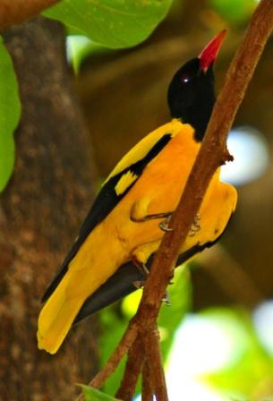
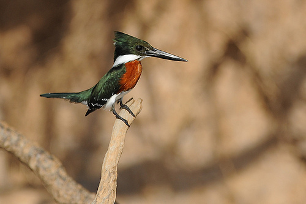

# Semantic-Guidance
This repository contains code for our CVPR-2021 paper on [Combining Semantic Guidance and Deep Reinforcement Learning For Generating Human Level Paintings](https://arxiv.org/pdf/2011.12589.pdf).

## Demo
| Target Image     | Baseline (Huang et al. 2019) | Semantic Guidance (Ours)  |
|:-------------:|:-------------:|:-------------:|
||||
||||
||||


### Setup

* Set up the python environment for running the experiments.
```bash
conda env update --name semantic-guidance --file environment.yml
conda activate semantic-guidance
```

### Dataset
* Download [CUB-200-2011 Birds](http://www.vision.caltech.edu/visipedia/CUB-200.html) dataset and place it in the `data/cub200/CUB_200_2011/` folder.
```bash
data
├── cub200/
│   └── CUB_200_2011/
│       └── images/
│             └── ...
│       └── images.txt
```


# Citation

If you use / discuss ideas from the semantic guidance pipeline in your work, please cite our paper:
```
@inproceedings{singh2021combining,
  title={Combining Semantic Guidance and Deep Reinforcement Learning For Generating Human Level Paintings},
  author={Jaskirat Singh and Liang Zheng},
  booktitle={Proceedings of the IEEE/CVF International Conference on Computer Vision},
  year={2021}
}

```

# Under Construction

This repository is under construction. Code and pretrained models would be added soon!
